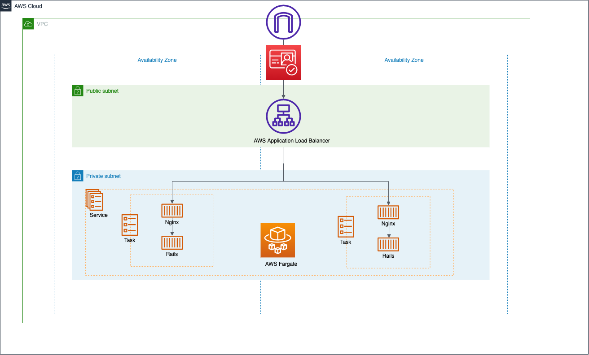

# CognitoとALBを使ってWebアプリにアクセス制限を設ける

今回は以下のようなユースケースを想定して、Cognitoによる解決を目指す。

- 開発環境やステージング環境でアクセスできる人間に制限を加えたい
- IPアドレスによる制限などが難しいが、アプリそのものの変更は難しい
  - Basic認証のようにアプリケーションの認証・認可とは別にアクセス制限を設けたい
- できるだけ少ない工数で実現したい

## やること

- CognitoのUserPoolの機能を使ってALBと連携して認証を埋めこむ
- 適当にサンプルアプリを立ち上げる
  - 立ち上げるアプリは本当にテキトー(適当ではない)



## 環境作成準備

### globalリソースの作成

環境によらないリソースをglobal配下で作成する。

- infra/globalフォルダへ移動
- 以下コマンドで terraformにより ECRリポジトリを作成する


```bash
terraform init
terraform plan
terraform apply
```

### サンプルアプリをECRリポジトリへプッシュする

サンプルのアプリを別リポジトリに用意しているため、そちらを利用する。

https://github.com/bun913/sample_app

READMEの説明を参考にして、ECRにイメージをプッシュする

### stagingのリソースを作成する

ステージング環境用のリソースを作成する

```bash
cd infra/staging
terraform init
terraform plan
terraform apply
```

ブラウザで今回ALBに割り当てる独自ドメイン名でアクセス(例: `https://hoge.com`)して、以下のようにCognitoの認証用のUIが表示されればOK

